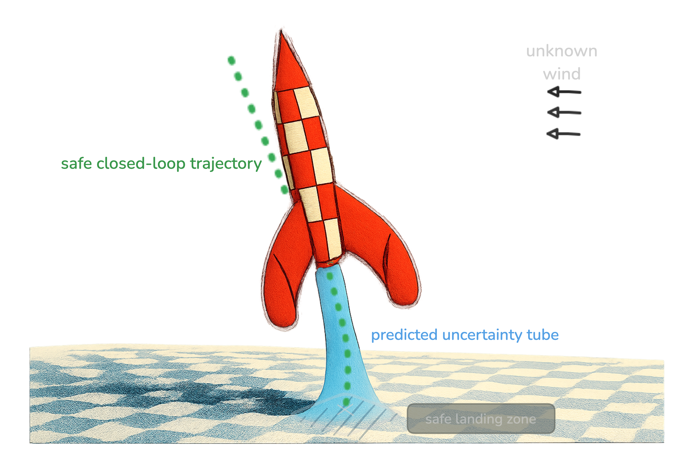

# Guaranteed Robust Nonlinear MPC via Disturbance Feedback

This repository contains scripts for running robust control simulations and experiments on **pendulum**, **quadrotor**, and **rocket** systems.  

---



<p align="center">
  
</p>

## Prerequisites
- Python **3.11+**
- Required packages: see `requirements.txt`
- Some scripts may require additional solvers (e.g., **IPOPT**)


## Setup with virtual environment
```bash
# Create a virtual environment (in folder .venv)
python -m venv .venv
# Activate the virtual environment
# On Linux/macOS:
source .venv/bin/activate
# On Windows:
.venv\Scripts\activate

# Install dependencies:
pip install -r requirements.txt
```

## Solver Generation
Run the script corresponding to your system to generate the necessary solvers:
```bash
python solver/generate_osqp_rockETH.py
```
Then, install:
```bash
cd build/osqp_fast && python -m pip install --use-pep517 . && cd ../..
```

Warning:
Always make sure to regenerate the solvers if you run new experiments. In particular, no error will be thrown if you use a solver on the wrong problem.


## Running Experiments
Most of the scripts starting with `main_` are used to run experiments. Options can be specified via command-line arguments. For example:
```bash
python main_rocket_robust_closed_loop.py --run
```

For instance, you can plot the results of the last experiment using:
```bash
python main_rocket_robust_closed_loop.py
```

## Notes
- All scripts save results in their respective output folders. The corresponding plot function will retrieve the last saved data and plot it.


